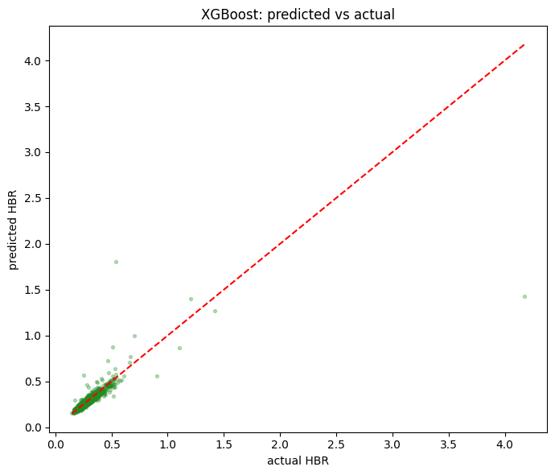
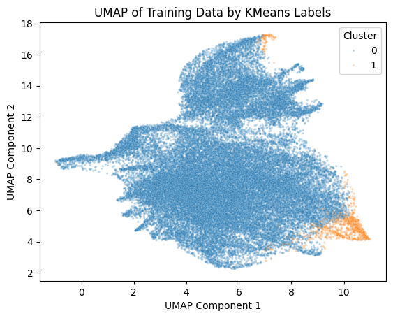
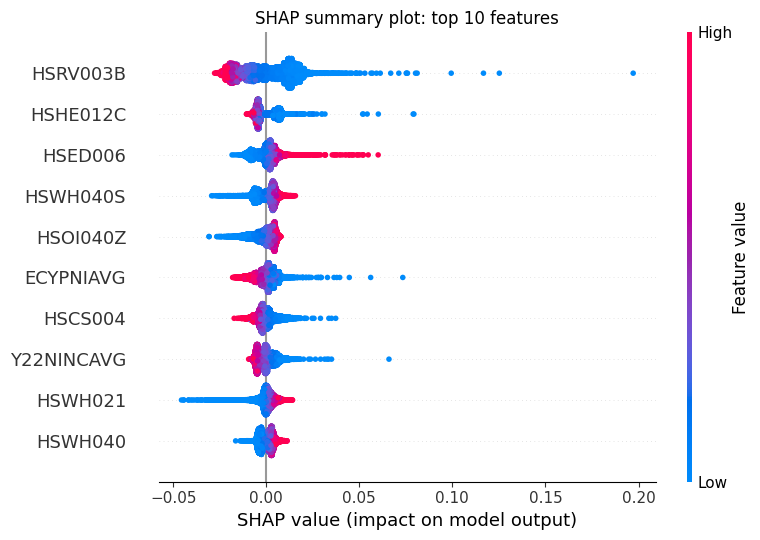

# Predicting Household Housing Burden in Canada

**Objective:** Identify key drivers of housing burden ratio (HBR) across 57,936 Canadian dissemination areas and build a predictive model.

**Key Findings:**
- **Best model:** XGBoost achieves **test R² = 0.7411**, substantially outperforming ElasticNet (R² = 0.4365)
- **Key drivers:** Low-income households ($0–19,999) and recreation spending are the top predictors (non-linear)
- **Data structure:** UMAP reveals two distinct household segments that linear PCA misses

**Methods:**
- Data: Environics Analytics (Household Spending + Demographics)
- Preprocessing: Polars lazy evaluation, target leakage removal
- Unsupervised: K-Means, PCA, UMAP
- Supervised: ElasticNet, XGBoost with hyperparameter tuning
- Interpretation: SHAP (TreeExplainer) for non-linear feature effects

---

## Results Preview Sample


*XGBoost predicted vs. actual HBR (test R² = 0.7411)*


*UMAP visualization showing two household segments*



---

## Repository Contents

| File | Description |
|------|-------------|
| `notebooks/ProjectCode.ipynb` | Complete, commented analysis notebook |
| `reports/final_report.pdf` | Full project report |
| `requirements.txt` | Python dependencies |

---

## Data Access & Confidentiality

**Important:** The raw data used in this project is proprietary to **Environics Analytics** and cannot be shared publicly. The complete dataset is approximately **several gigabytes** across 8 CSV files.

If you have access to the same data, the analysis can be reproduced as follows:

1. Place the following files in the expected paths (as shown in the notebook):
   - Household spending data (example):  
     `/content/drive/MyDrive/Data/HouseholdSpend_CSV.zip`
   - Demographic statistics data (example):  
     `/content/drive/MyDrive/Data/DemoStats_CSV.zip`

2. Update the file paths in the notebook to match your local environment.

3. Run the notebook from start to finish. The code uses **Polars lazy evaluation** to handle large files efficiently without loading them entirely into memory.

The sample data used in this analysis is **confidential** and subject to the terms of use of Environics Analytics. No raw data is included in this repository.

---

## Requirements

```bash
pip install -r requirements.txt